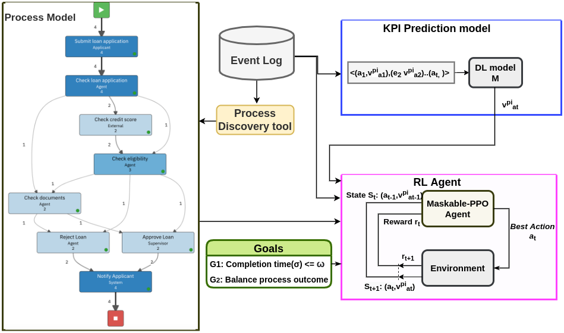

 [](https://travis.ibm.com/retail-supply-chain/template) [](https://github.com/psf/black)

# Goal-oriented-next-best-activity-recommendations

Code for our paper titled "Goal-Oriented Next Best Activity Recommendation using Reinforcement Learning" (under review in BPM-2022)

## Description
We propose a novel sytem for Goal-oriented next best action recommendation in busincess processes using Reinforcement Learning.
<br>


<br>
In the diagram above, pre-processed event log is passed on to Deep Learning model(GAN LSTM) which is trained for KPI prediction. Reinforcement learning agent is given the KPI predictions of trained DL model, process model(DFG graph), event log and KPI goals. It recommends the next best action to be taken optimising various KPI goals.

 Repository Structure
```
├── src
	├── rl_main.py                      	# run this for RL agent training and testing
	├── rl_environment.py                   # contains code for Rl environment
	├── dl_main.py 				# training and testing of DL model
	├── timestamp_prediction.py		# file for timestamp prediction given prev log and current event
	├── event_prediction.py			# file for next event prediction
	├── event_timestamp_prediction.py  	# both next event and timestamp prediction
	├── RL_Agent 				# RL Agent algo, train, test code
		├── trainRL_Agent.py		
		├── testRL_Agent.py 
		├── maskable_PPO.py		# contains maskable-PPO implementation
		├── variable_action_space   	# wrapper for variable action space
	├── dcr 				# contains dcr graph code
	├── dataset 				# various datasets including helpdesk, bpic datasets
		├── preprocessed 		# preprocessed datasets
		├── event_logs                  # raw event logs (xes/csv format)  
			├── xes2csv.py          # script to convert xes to csv format 
		├── dataset_details.ipynb       # All important detials of various datasets summarised
	├── RL_checkpoints			# Checkpoints of trained RL agent	
	├── RL_logs				# Contrains logs for RL agent training(created during training)
	├── checkpoints 			# DL models checkpoints(created during training)
	├── dataset_div 			# custom train test split code 
	├── utils.py 				# various utility functions
	├── dqn_tensorforce.py 			# code for training DQN agent (large negative reward)
	├── ppo_tensorforce.py			# code for training PPO agent (large negative reward)
├── environment.yml
├── requirements.txt 
```
## Setup
### Dependencies
* Pytorch, Torchvision
* Tensorforce
* Tensorflow
* Gym
* matplotlib
* numpy
* pandas
* tqdm
* scikit-learn
* pickle
* datetime


### System Tested
The code in the repository has been tested on: <br>
* Ubuntu 20.04, Ubuntu 18.04 <br>
* cuda toolkit 10.1, 10.2
* python 3.7 (compatible with 2.x < python <=3.7)

Note: The codebase has also been tested on [IBM ccc](http://ccc.pok.ibm.com/)


## Instructions to run code
* clone the repository <br>
```
git clone https://github.ibm.com/irl-internship-2021/goal-oriented-recommendations.git
```
* Install dependences
create [anconda](https://www.anaconda.com/) environment 
```
conda env create -f environment.yml
```
or install using pip
```
pip install -r requirements.txt
```
* training and testing model for next timestamp(or KPI) and activity prediction
```
python dl_main.py
		  --path <dataset path>
                  --mode <event_timestamp_prediction or event_prediction or timestamp_prediction>
                  --epochs <epochs>
```
checkpoints are written to ```checkpoints/<env_name>``` 

* training and testing RL agent for next best action recommendation based on various KPI goals
```
python rl_main.py 
                 --train_episodes <number of episodes to train on>
                 --test_episodes <number of episodes to test>
```
checkpoints are written to ```RL_checkpoints/PPO_Pretrained/<env_name>``` <br>
logs are written to ```RL_logs/PPO_logs/<env_name>``` 


## Additional experimentation

### Customizing RL environment
In order to customize RL enviroment (changing reward function, etc) edit [RL env](RL_env/rl_environment.py)
```rl_environment.py``` inherits from ```rl_environment_base.py```.

### Adding additional KPI goals
Edit the reward function of RL agent for adding addtional KPI goals.

### Training on a different KPI
Edit ```timestamp_prediction.py``` along with editing preprocessing file ```preparation.py``` for your desired KPI.

### Training on your own dataset of activity logs
* If the acitivty log is in ```.xes``` format, convert it to csv by running ```dataset/event_log/xes2csv.py```.
* Put the dataset (csv/pkl format) in ```dataset``` folder.
* To get the maximum prefix length for your dataset you can use function ```get_trace_len``` from utils.py.
* run ```dl_main.py``` with your required arguments (dataset path, mode(acitivty/timestamp/event_timestamp_prediction), epochs, prefix length, etc)	
* One DL model is trained, activity/timestamp/any other KPI model prediction is done.
* Train the RL agent for next best action recommendation by running```rl_main.py``` with your desired arguments.
	

## References and Acknowledgements
* DL model and DCR graph code builds upon [GANPred](https://github.com/farbodtaymouri/GanPredictiveMonitoring)
* PPO code is based on [PPO](https://github.com/nikhilbarhate99/PPO-PyTorch) and maskable PPO is implemented following [Implementing action mask in proximal policy optimization (PPO) algorithm](https://www.sciencedirect.com/science/article/pii/S2405959520300746)
* [Predictive Business Process Monitoring via Generative Adversarial Nets: The Case of Next Event Prediction](http://link.springer.com/chapter/10.1007/978-3-030-58666-9_14)
* [Prescriptive Business Process Monitoring for Recommending Next Best Actions](https://www.researchgate.net/publication/342391344_Prescriptive_Business_Process_Monitoring_for_Recommending_Next_Best_Actions)
* [Triggering Proactive Business Process Adaptations via Online Reinforcement Learning](https://link.springer.com/chapter/10.1007/978-3-030-58666-9_16#:~:text=Only%20a%20reliable%20prediction%20is,by%20a%20random%20forest%20classifier.)
* [A Formal_Model_For_Declarative_Workflows_Dynamic_Condition_Response_Graphs](https://www.researchgate.net/publication/262379110_A_Formal_Model_For_Declarative_Workflows_Dynamic_Condition_Response_Graphs)


