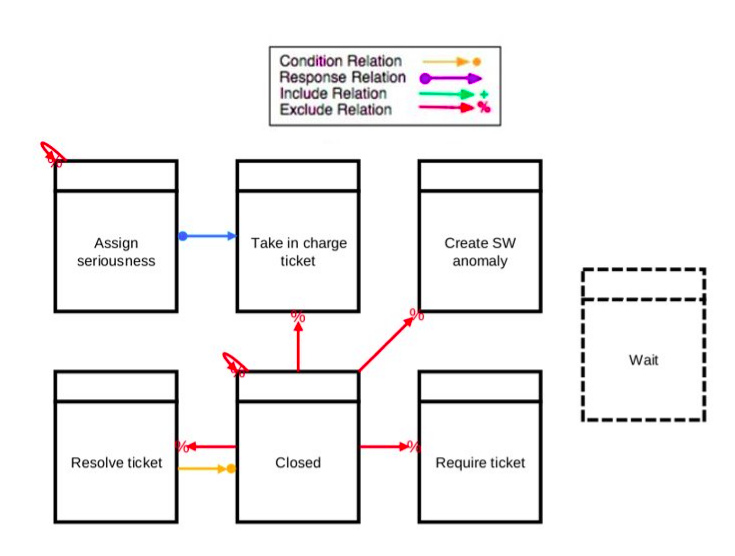

# DCR Graph

Dynamic Condition Response Graph is used to incorporate process sequence flow (used as a process model)​

* **Condition:** creates a relation between an activity A and an activity B such that B can only occur if first A has occurred​

* **Response:** The Response connection creates a relation between an activity A and an activity B such that B has to occur, at least once, at some point after, if A occurs. B can occur even if A never occurs. But if A, then B.​

* **Include:** creates a relation between an activity A and an activity B such that the occurrence of activity A makes possible the occurrence of activity B if it wasn't previously included in the workflow​

* **Exclude:** creates a relation between an activity A and an activity B such that B cannot occur if first A has occurred.​

* **Milestone:** creates a relation between an activity A and an activity B such that B can occur initially. But if A becomes pending for a response connection by another activity C, then B cannot occur until A has occurred​

* **Spawn:** The Spawn connection creates a relation between an activity A and a sub-activity B such that, when A occurs, a new instance of B is created​

​

​
The DCR graph(Dynamic Condition Response) for the helpdesk event log is shown below. ​
​  
source:[Prescriptive Business Process Monitoring for Recommending Next Best Actions](https://www.researchgate.net/publication/342391344_Prescriptive_Business_Process_Monitoring_for_Recommending_Next_Best_Actions)

* The three most important constraints are the following. ​
* After “Closed” the other activities should not happen. ​
* If “Assign seriousness” occurs, someone must take over the responsibility. ​
* Before a ticket is closed, “Resolve ticket” must occur.​

## References:
* [Code reference: GANPredictiveMonitoring](https://github.com/farbodtaymouri/GanPredictiveMonitoring)
* [A Formal Model For Declarative Workflows Dynamic Condition Response Graphs](https://www.researchgate.net/publication/262379110_A_Formal_Model_For_Declarative_Workflows_Dynamic_Condition_Response_Graphs​)
* [Nested Dynamic Condition Response Graphs](https://pure.itu.dk/portal/files/34548834/fsenpaper.pdf)